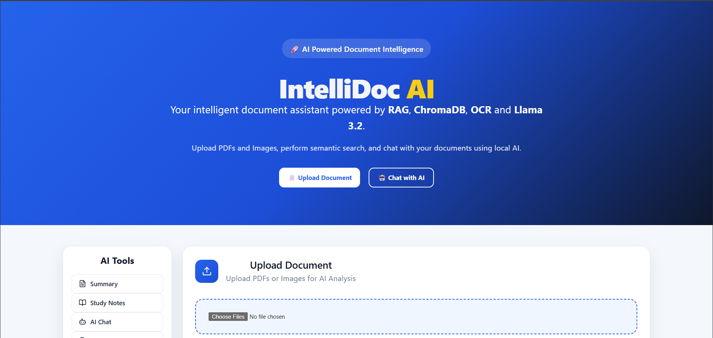
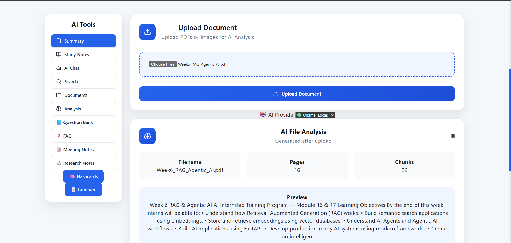
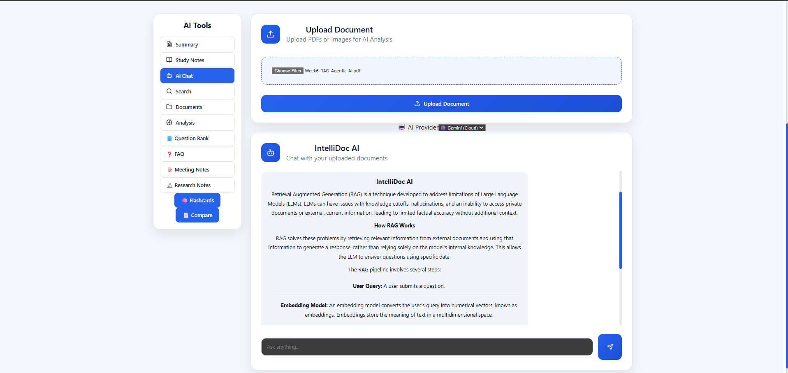
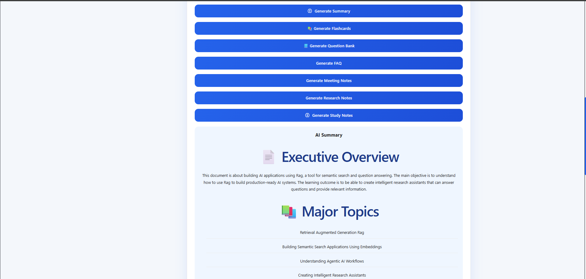

<div align="center">

# 🚀 IntelliDoc

### AI-Powered Document Intelligence Platform

**Transform static PDF documents into an intelligent, searchable knowledge base using Artificial Intelligence.**

<p align="center">


</p>

*A Full Stack AI application built with React, FastAPI, ChromaDB, Retrieval-Augmented Generation (RAG), and Large Language Models.*

</div>

---

# 📖 Table of Contents

- Overview
- Why IntelliDoc?
- Key Features
- System Architecture
- Technology Stack
- Project Structure
- Installation
- Usage
- AI Workflow
- Future Roadmap
- Contributing
- Developer

---

# 📌 Overview

**IntelliDoc** is an AI-powered Document Intelligence Platform that enables users to upload PDF documents and interact with them using natural language.

Instead of manually searching through lengthy documents, users can ask questions, generate summaries, create study notes, compare documents, and export AI-generated reports within seconds.

The project combines modern Artificial Intelligence techniques including **Retrieval-Augmented Generation (RAG)**, **Semantic Search**, **Vector Databases**, and **Large Language Models (LLMs)** to provide accurate, context-aware responses.

---

# 🎯 Why IntelliDoc?

Traditional PDF readers only display document content.

IntelliDoc transforms documents into an intelligent knowledge base by combining AI with semantic understanding. Rather than searching for exact keywords, users can communicate with their documents naturally and receive meaningful responses backed by document context.

---

# ✨ Key Features

## 📄 Document Processing

- Upload PDF Documents
- Automatic Text Extraction
- Metadata Extraction
- Intelligent Chunking
- Overlapping Chunks
- Embedding Generation

---

## 🤖 AI Capabilities

- 💬 AI Chat with Documents
- 🔍 Semantic Search
- 📝 AI Summary
- 📚 Study Notes
- 🃏 Flashcards
- ❓ Question Bank
- 📌 FAQ Generation
- 📋 Meeting Notes
- 📖 Research Notes
- 📊 Compare Documents

---

## 📤 Export

- Export Summary as PDF
- Export Summary as DOCX
- Download AI Reports

---

## ⚡ AI Providers

- Google Gemini
- Ollama (Local LLM Support)

---

# 🏗️ System Architecture

```text
                    User
                      │
                      ▼
              React Frontend
                      │
                      ▼
              FastAPI Backend
                      │
      ┌───────────────┼───────────────┐
      ▼               ▼               ▼
 PDF Service    Vector Service    Export Service
      │               │
      ▼               ▼
 Chunk Service    ChromaDB
      │               │
      └───────┬───────┘
              ▼
      Relevant Context
              │
      ┌───────┴────────┐
      ▼                ▼
 Google Gemini      Ollama
      │                │
      └───────┬────────┘
              ▼
      AI Generated Output
```

---

# ⚙️ Technology Stack

| Category | Technologies |
|-----------|--------------|
| Frontend | React, Vite, CSS |
| Backend | FastAPI, Python |
| AI Models | Google Gemini, Ollama |
| NLP | NLTK |
| Embeddings | Sentence Transformers |
| Vector Database | ChromaDB |
| PDF Processing | PyPDF |
| Export | ReportLab, python-docx |

---

# 📂 Project Structure

```text
IntelliDoc-AI
│
├── backend
│   ├── app
│   │   ├── routes
│   │   ├── services
│   │   ├── models
│   │   └── main.py
│   ├── uploads
│   ├── vector_db
│   ├── generated_reports
│   └── requirements.txt
│
├── frontend
│   ├── src
│   ├── public
│   └── package.json
│
├── docs
├── notebooks
├── screenshots
└── README.md
```

---

# 🌟 Project Highlights

- ✅ Full Stack AI Application
- ✅ Retrieval-Augmented Generation (RAG)
- ✅ Semantic Search with ChromaDB
- ✅ Google Gemini Integration
- ✅ Ollama Local LLM Support
- ✅ AI-Powered Document Analysis
- ✅ Smart Study Material Generation
- ✅ Multi-Document Comparison
- ✅ Export to PDF & DOCX
- ✅ Modular Service-Based Architecture

---

# 📸 Screenshots

## 🏠 Home Page



---

## 📄 Upload Page



---

## 💬 AI Chat



---

## 📝 AI Summary



---


# 🚀 Installation

## 1️⃣ Clone the Repository

```bash
git clone https://github.com/pratyaksh3107/IntelliDoc-AI.git
cd IntelliDoc-AI
```

---

## 2️⃣ Backend Setup

Navigate to the backend directory:

```bash
cd backend
```

Create a virtual environment:

```bash
python -m venv venv
```

Activate the virtual environment:

**Windows**

```bash
venv\Scripts\activate
```

**Linux / macOS**

```bash
source venv/bin/activate
```

Install dependencies:

```bash
pip install -r requirements.txt
```

Start the FastAPI server:

```bash
uvicorn app.main:app --reload
```

Backend will run on:

```
http://localhost:8000
```

---

## 3️⃣ Frontend Setup

Open another terminal:

```bash
cd frontend
```

Install dependencies:

```bash
npm install
```

Start the development server:

```bash
npm run dev
```

Frontend will run on:

```
http://localhost:5173
```

---

# 💡 How to Use

### Step 1

Upload a PDF document.

### Step 2

The backend extracts the document text.

### Step 3

The extracted text is cleaned and divided into overlapping chunks.

### Step 4

Sentence Transformers generate embeddings for each chunk.

### Step 5

Embeddings are stored in ChromaDB.

### Step 6

Choose any AI feature:

- AI Chat
- Semantic Search
- Summary
- Study Notes
- Flashcards
- Question Bank
- FAQ
- Meeting Notes
- Research Notes
- Compare Documents

### Step 7

Relevant document context is retrieved.

### Step 8

Google Gemini or Ollama generates the final response.

---

# 🧠 AI Workflow

```text
               Upload PDF
                    │
                    ▼
          Extract Document Text
                    │
                    ▼
            Clean & Preprocess
                    │
                    ▼
          Intelligent Chunking
                    │
                    ▼
        Generate Vector Embeddings
                    │
                    ▼
          Store in ChromaDB
                    │
                    ▼
          User Selects AI Feature
                    │
      ┌─────────────┼─────────────┐
      ▼             ▼             ▼
 AI Chat      Semantic Search   Summary
      │             │             │
      └─────────────┼─────────────┘
                    ▼
      Retrieve Relevant Chunks
                    │
         Google Gemini / Ollama
                    │
                    ▼
        Generate Intelligent Output
                    │
                    ▼
        Display Results to User
```

---

# 📊 Project Statistics

| Category | Details |
|-----------|---------|
| Frontend | React + Vite |
| Backend | FastAPI |
| Programming Language | Python |
| AI Models | Gemini & Ollama |
| Vector Database | ChromaDB |
| Embedding Model | all-MiniLM-L6-v2 |
| AI Features | 10+ |
| REST APIs | 8+ |
| Export Formats | PDF & DOCX |

---

# 🎯 Use Cases

IntelliDoc can be used across multiple domains.

### 🎓 Education

- Smart Revision Notes
- Flashcards
- Question Banks
- Exam Preparation

### 🔬 Research

- Research Paper Summaries
- Literature Review
- Technical Analysis

### 🏢 Business

- Meeting Notes
- Report Summaries
- Knowledge Management

### ⚖️ Legal

- Contract Comparison
- Legal Document Analysis

### 🏥 Healthcare

- Medical Report Summaries
- Clinical Documentation

---

# 🛣️ Roadmap

### Completed

- [x] PDF Upload
- [x] AI Chat
- [x] Semantic Search
- [x] AI Summary
- [x] Study Notes
- [x] Flashcards
- [x] Question Bank
- [x] FAQ Generator
- [x] Meeting Notes
- [x] Research Notes
- [x] Compare Documents
- [x] Export PDF
- [x] Export DOCX
- [x] Google Gemini Integration
- [x] Ollama Integration

### Planned

- [ ] OCR Support
- [ ] Multi-PDF Chat
- [ ] User Authentication
- [ ] Cloud Deployment
- [ ] Voice Assistant
- [ ] Multi-language Support
- [ ] Mobile Application

---

# 🤝 Contributing

Contributions, feature suggestions, and bug reports are welcome.

If you'd like to improve IntelliDoc:

1. Fork the repository.
2. Create a new branch.
3. Commit your changes.
4. Open a Pull Request.

---

# 👨‍💻 Developer

**Pratyaksh Mathur**

B.Tech – Artificial Intelligence & Data Science

Poornima College of Engineering, Jaipur

**GitHub:** https://github.com/pratyaksh3107

---

# 🙏 Acknowledgements

Special thanks to the amazing open-source community and technologies that made this project possible.

- React
- FastAPI
- ChromaDB
- Sentence Transformers
- Google Gemini
- Ollama
- ReportLab
- python-docx

---

# 📜 License

This project is licensed under the **MIT License**.

Feel free to use, modify, and contribute while following the license terms.

---

<div align="center">

## ⭐ If you found this project helpful, please consider giving it a Star!

**Made with ❤️ using React, FastAPI, Python, ChromaDB, Google Gemini & Ollama**

</div>